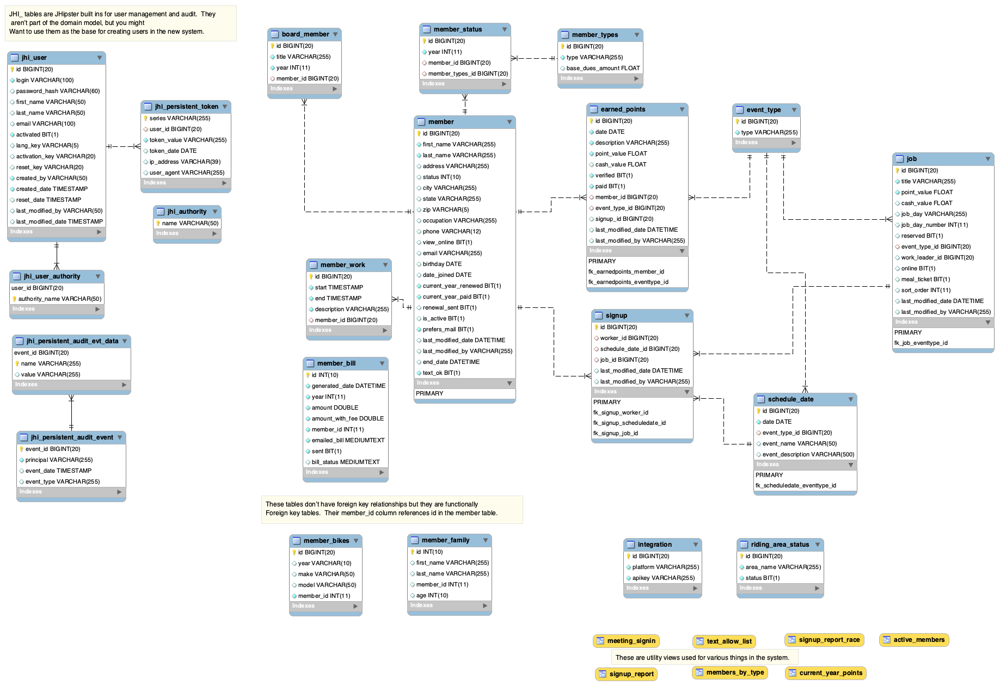

# PRA Clubmanager database

# Overview
The PRA Clubmanager database provides the data store for all our applications.  It is also the primary Source of Truth for all information about club members, the work they've done, all the personal information. Basically if you've been a member of PRA since the 2016 season, or worked for us for money, your info is in here in some way.

# Classes of tables
In general there are 3 classes of tables in the database. They intersect in different ways (or don't, depending on what they are).

## System tables
# JHipster system tables (jhi_)
I created the initial clubmanager project with an older version of JHipster (http://jhipster.tech).  It's a Yeoman (https://yeoman.io/) generator that creates some stuff from templates so that you can focus on coding your application logic.  One of the things it provides is a username/password system, as well as some auditing and system monitoring functions.

The jhi_user_authority table is the table containing roles, and the jhi_user has usernames and encrypted passwords.  

# `integration` table
This is a simple table containing API keys I use for external integrations, as well as the gate code.  It's a system table but one that I built.

# Member tables
Information about members is contained in a few tables.
* `member` and `member_*` - these contain primary information about a member, as well as ancillary information related to the member's family, bikes owned, status in the club, and previous year billing.  
* `earned_points` is also a member data table. It contains data about the jobs the member has signed up for and completed, for both points, as well as cash.  This is aggregated, then used in our annual billing cycle to determine the member dues for the season.  We also sometimes use it to produce on demand reporting about who's done what and when.

# Schedule tables
* `event_type` contains the different types of events that fall on our schedule during a given year.
* `schedule_date` is an event on our schedule. It has an `event_type` foreign key relationship.

# Schedule and event work tables
* `job` represents a job that can be performed at an event.  As such it is tied to both of those with a foreign key.  This also means that once a job is changed for the event type, it "sticks" for that event type forever until it is changed again. So each Motocross race has the same set of jobs which is a great help for consistency.
* `signup` is a worker signing up to do a job for a given event.  This only contains 3 foreign key relationships, one to the worker (member or paid labor), one to the event (schedule date) and one to the job (job).  
* `signup_report` is a view of what is actually going on with signups since `signup` is a foreign key only table.  `signup_report`'s view definition joins to the columns that make that report make sense to a human reading it.
* A `signup` record also creates a `earned_points` record for the member when it is created.  That `earned_points` record sits in a state of `unverified` until the club secretary verifies it AFTER the event is complete, and all workday sheets from the event have been turned in.

# ERD
